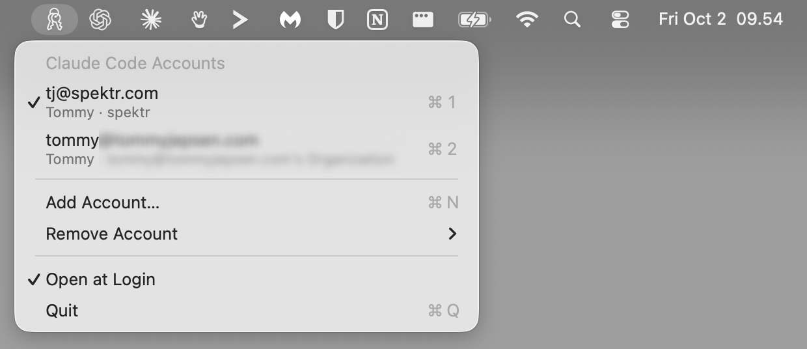

# Claude Switcher

A macOS menu bar app for switching between Claude Code accounts, for example a work
account and a personal one, without logging out and back in.



## Install

Requires macOS 13+ and the Swift toolchain (Xcode or the Command Line Tools:
`xcode-select --install`).

```sh
git clone https://github.com/tommyjepsen/claude-code-account-switcher.git
cd claude-code-account-switcher
./build.sh --install
```

That builds the app, copies it to `/Applications` and launches it. Look for the key ring
icon in the menu bar. Running `./build.sh` without `--install` only builds
`build/ClaudeSwitcher.app`.

Building it yourself avoids Gatekeeper warnings. The app is ad-hoc signed and not notarized,
so a copy of the `.app` downloaded from someone else is blocked until you allow it in
**System Settings → Privacy & Security**.

To update, `git pull` and run `./build.sh --install` again.

## Use

- Click the icon in the menu bar to see your saved accounts. The active one has a checkmark.
  Your current Claude Code login is saved automatically the first time you open the menu.
- Click an account (or press ⌘1–⌘9 while the menu is open) to switch to it.
- **Add Account…** saves the current login, then opens a terminal running `claude auth login`.
  Log in with the other account, and it appears the next time you open the menu.
- **Remove Account** deletes a saved login (you can't remove the active one).
- **Open at Login** starts the app automatically (works when run from /Applications).

## How it works

Claude Code stores its login in two places:

| What | Where |
|---|---|
| OAuth tokens | Keychain item `Claude Code-credentials` |
| Account info | `oauthAccount` key in `~/.claude.json` |

Each time the menu opens, the app saves the current login: the tokens go to the Keychain
under service `ClaudeSwitcher`, and the account info to
`~/Library/Application Support/ClaudeSwitcher/accounts.json`. Switching writes the chosen
account's saved values back to both places. No other keys in `~/.claude.json` are changed.

Before saving a token it hasn't seen before, the app asks Anthropic which account it belongs
to (`GET https://api.anthropic.com/api/oauth/profile`, the same call Claude Code makes). That
is the only network request it makes, and it only happens when the token has changed. If the
token belongs to a different account than `~/.claude.json` says, it is filed under its real
owner and the menu shows a warning with a **Restore** action. If it can't be checked
(offline, expired), nothing is saved and it retries the next time the menu opens.

All Keychain access goes through `/usr/bin/security`, the same tool Claude Code uses, so
the item stays readable by Claude Code without extra password prompts.

## Caveats

- Claude Code sessions that are already running keep the account they started with.
  Restart them after switching. A running session on the old account can also refresh its
  token and overwrite the new account's credentials. The app catches that (see above), but
  it's easiest to close old sessions before switching.
- If an account's saved tokens stop working (for example, you logged out of it elsewhere),
  remove it and add it again.

## Project layout

| File | What it does |
|---|---|
| `Sources/ClaudeSwitcher/main.swift` | Menu bar item and menu |
| `Sources/ClaudeSwitcher/AccountStore.swift` | Saved accounts, syncing and switching |
| `Sources/ClaudeSwitcher/OAuthProfile.swift` | Checks which account a token belongs to |
| `Sources/ClaudeSwitcher/ClaudeConfig.swift` | Reads and writes Claude Code's login |
| `Sources/ClaudeSwitcher/Keychain.swift` | Keychain access via `/usr/bin/security` |
| `build.sh` | Builds the `.app` bundle and optionally installs it |
